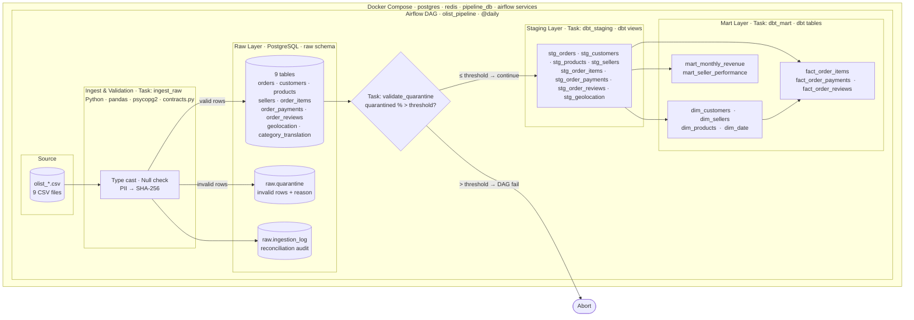
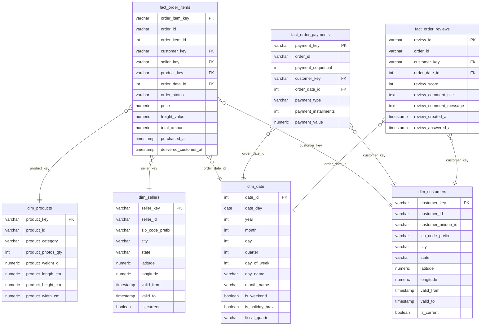

# Olist Brazilian E-Commerce Data Pipeline

A production-style Medallion data pipeline built on the [Olist](https://www.kaggle.com/datasets/olistbr/brazilian-ecommerce) public dataset. Raw CSV files flow through validation, a PostgreSQL Raw layer, dbt Staging views, and dbt Mart tables — all orchestrated by Apache Airflow inside Docker Compose.

---

## Table of Contents

1. [Project Overview](#1-project-overview)
2. [Architecture](#2-architecture)
3. [Star Schema](#3-star-schema)
4. [Data Quality](#4-data-quality)
5. [Design Decisions](#5-design-decisions)
6. [Pipeline Validation Results](#6-pipeline-validation-results)
7. [Quick Start](#7-quick-start)
8. [Project Structure](#8-project-structure)
9. [Environment Variables](#9-environment-variables)
10. [Known Limitations](#10-known-limitations)

---

## 1. Project Overview

This project ingests nine CSV files from the Olist Brazilian e-commerce dataset, validates and cleans them, and transforms them into an analytics-ready star schema. The result is a set of dimension and fact tables that power monthly revenue, seller performance, and order-delivery analytics.

**Key features**

| Feature | Detail |
|---|---|
| Medallion architecture | Raw → Staging (dbt views) → Mart (dbt tables) |
| Data contracts | Column type, nullability, and PII rules defined in `contracts.py` |
| Quarantine pattern | Invalid rows are diverted to `raw.quarantine` with a structured reason; a configurable threshold aborts the DAG if quality degrades |
| PII protection | `customer_zip_code_prefix` and `seller_zip_code_prefix` are SHA-256-hashed at ingest |
| Idempotent ingest | `ON CONFLICT (pk) DO NOTHING` prevents duplicate loads |
| Full audit trail | `raw.ingestion_log` records row counts, timestamps, and status per run |
| dbt testing | 59 schema tests across all staging and mart models |
| Orchestration | Apache Airflow 3.1.7 (CeleryExecutor) — daily schedule, max 1 active run |

---

## 2. Architecture



**DAG task order**

```
ingest_raw  →  validate_quarantine  →  dbt_staging  →  dbt_mart
```

---

## 3. Star Schema



---

## 4. Data Quality

### Contract validation
`ingest/contracts.py` defines a `TableContract` per source file specifying column name, dtype (`str | int | float | datetime`), and nullability. Every row is cast and checked before it reaches the database.

### Quarantine
Rows that fail contract checks are written to `raw.quarantine` with:
- `source_table` — which table the row belongs to
- `row_data` — full row as JSONB
- `reason` — human-readable failure description (e.g. `"order_id: required field is null/empty"`)

The Airflow task `validate_quarantine` compares quarantined rows against total rows for the latest run. If the percentage exceeds `QUARANTINE_THRESHOLD_PCT` (default 5 %), the DAG fails fast before any dbt transformation runs.

### Reconciliation
`raw.ingestion_log` records `rows_total`, `rows_inserted`, and `rows_quarantined` for every file in every run, enabling exact reconciliation between source CSV counts and what landed in the Raw layer.

### Schema drift protection
Because every column is explicitly enumerated in the contract, any new or missing column in a source CSV raises a `ValueError` during ingest and is captured in the ingestion log, preventing silent schema drift.

### PII masking
`customer_zip_code_prefix` (customers) and `seller_zip_code_prefix` (sellers) are SHA-256-hashed at ingestion time. The original values never enter the database.

### Idempotency
All `INSERT` statements use `ON CONFLICT (primary_key) DO NOTHING`. Re-running the pipeline against the same CSV files produces no duplicate rows.

---

## 5. Design Decisions

### Why Medallion (Raw → Staging → Mart)?
Each layer has a single responsibility. Raw preserves the source exactly (plus audit metadata). Staging normalises and types. Mart builds analytics-optimised structures. This makes it cheap to re-derive any layer without re-ingesting from source, and easy to debug failures at a specific layer.

### Why dbt for Staging and Mart?
dbt gives us version-controlled, testable SQL, automatic lineage, and the `ref()` function for dependency resolution. It also means Staging is a zero-cost view layer (no storage duplication) while Mart tables are materialised exactly once per run.

### Fact grain choices
| Fact table | Grain | Rationale |
|---|---|---|
| `fact_order_items` | one row per order line item | lowest natural grain; enables product- and seller-level revenue analysis |
| `fact_order_payments` | one row per payment instalment | a single order can have multiple payment methods; this grain captures each |
| `fact_order_reviews` | one row per review | reviews have a 1:1 relationship with orders but their own timing attributes |

### SCD Type 2 for customers and sellers
`dim_customers` and `dim_sellers` carry `valid_from`, `valid_to`, and `is_current` columns. This design anticipates customer or seller attribute changes (city, state) over time without losing history. The current pipeline always inserts a new current record; the `valid_to` / `is_current` update logic is the natural next extension.

---

## 6. Pipeline Validation Results

| Check | Result |
|---|---|
| Raw row counts match CSV totals | Pass — reconciled via `raw.ingestion_log` |
| Quarantine rate | < 5 % across all 9 source tables |
| dbt schema tests | **59 / 59 passed** (not_null, unique, accepted_values, relationships) |
| FK unmatched rows | **0** — all fact foreign keys resolve to a dimension key |
| Average order delivery time | **12.47 days** (purchase → delivered to customer) |

---

## 7. Quick Start

### Prerequisites
- Docker Desktop (≥ 4.x) with at least 4 GB RAM allocated
- Docker Compose v2
- Python 3.12+ (only for running ingest locally outside Docker)

### 1. Clone the repository

```bash
git clone <repo-url>
cd "Final Project Data arc"
```

### 2. Configure environment

Copy or edit `.env` at the project root:

```bash
# .env
AIRFLOW_UID=50000

PIPELINE_DB_USER=pipeline_user
PIPELINE_DB_PASSWORD=pipeline_password
PIPELINE_DB_HOST=localhost
PIPELINE_DB_PORT=5433
PIPELINE_DB_NAME=raw

QUARANTINE_THRESHOLD_PCT=5.0
```

### 3. Start all services

```bash
docker compose up -d
```

Wait until `airflow-apiserver` is healthy (≈ 60–90 s):

```bash
docker compose ps
```

The Airflow UI is available at **http://localhost:8080** (default credentials: `airflow` / `airflow`).

### 4. Run ingest (first time)

The ingest script can be run directly (outside Airflow) to populate the Raw layer:

```bash
# activate your virtual environment first
pip install -r ingest/requirements.txt
python ingest/ingest.py
```

Or trigger via the DAG (step 5 will do this automatically).

### 5. Trigger the DAG

In the Airflow UI, unpause and manually trigger **`olist_pipeline`**, or use the CLI:

```bash
docker compose exec airflow-apiserver airflow dags trigger olist_pipeline
```

The four tasks run in sequence:

```
ingest_raw → validate_quarantine → dbt_staging → dbt_mart
```

---

## 8. Project Structure

```
.
├── dags/
│   └── olist_pipeline.py          # Airflow DAG definition
├── dbt/
│   ├── dbt_project.yml            # dbt project config
│   ├── profiles.yml               # dbt connection profile
│   ├── packages.yml               # dbt_utils dependency
│   ├── macros/
│   │   └── generate_schema_name.sql
│   └── models/
│       ├── staging/               # dbt views — 8 stg_* models
│       └── marts/                 # dbt tables — dims, facts, mart aggregations
├── ingest/
│   ├── contracts.py               # TableContract definitions (schema + PII rules)
│   ├── ingest.py                  # Ingest entrypoint — validate, hash, load
│   └── requirements.txt
├── initdb/
│   └── init-pipeline-db.sql       # Creates staging and mart databases on first start
├── config/
│   └── airflow.cfg                # Airflow configuration override
├── olist_*.csv                    # Source datasets (9 files)
├── docker-compose.yaml
└── .env
```

---

## 9. Environment Variables

| Variable | Default | Description |
|---|---|---|
| `AIRFLOW_UID` | `50000` | UID for Airflow container processes |
| `PIPELINE_DB_USER` | `pipeline_user` | PostgreSQL user for the pipeline database |
| `PIPELINE_DB_PASSWORD` | `pipeline_password` | PostgreSQL password |
| `PIPELINE_DB_HOST` | `localhost` | Host when connecting from outside Docker (`pipeline_db` inside Docker) |
| `PIPELINE_DB_PORT` | `5433` | Exposed port of the `pipeline_db` container |
| `PIPELINE_DB_NAME` | `raw` | Database name (Raw schema lives here; Staging and Mart are separate databases) |
| `QUARANTINE_THRESHOLD_PCT` | `5.0` | DAG aborts if quarantine rate exceeds this percentage |
| `_AIRFLOW_WWW_USER_USERNAME` | `airflow` | Airflow UI admin username |
| `_AIRFLOW_WWW_USER_PASSWORD` | `airflow` | Airflow UI admin password |

---

## 10. Known Limitations

- **SCD Type 2 updates not implemented** — `dim_customers` and `dim_sellers` have the `valid_from / valid_to / is_current` columns, but the current pipeline always inserts a fresh current record rather than closing the previous one. Full SCD Type 2 requires a snapshot strategy (e.g. `dbt snapshot`).
- **Batch-only ingest** — the pipeline reads full CSV files on every run. There is no incremental extraction from a source system; re-running against updated CSVs will not insert duplicate rows (idempotency is guaranteed), but deleted rows in the source are not handled.
- **Single-node Celery worker** — the `docker-compose.yaml` starts one worker. For larger datasets, multiple workers or a different executor (e.g. KubernetesExecutor) would be needed.
- **Geolocation deduplication** — the source `olist_geolocation_dataset.csv` contains multiple rows per zip code prefix. The staging model keeps the first occurrence; more sophisticated aggregation (e.g. centroid) would be more accurate.
- **No email/alerting on failure** — the `on_failure_callback` logs to the Airflow task log only. Integrating with SMTP, Slack, or PagerDuty requires additional configuration.
- **CSV files are not versioned** — source files sit at the project root. A proper setup would store them in object storage (S3, GCS) with version tracking.
