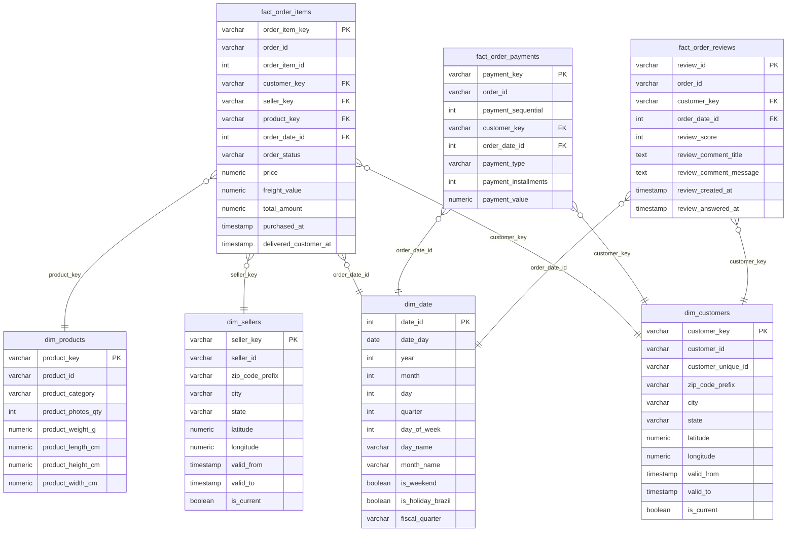

# Olist Brazilian E-Commerce Data Pipeline

A production-style Medallion data pipeline built on the [Olist](https://www.kaggle.com/datasets/olistbr/brazilian-ecommerce) public dataset. Raw CSV files flow through validation, a PostgreSQL Raw layer, dbt Staging views, and dbt Mart tables — all orchestrated by Apache Airflow inside Docker Compose.

---

## Table of Contents

1. [Project Overview](#1-project-overview)
2. [Tech Stack](#2-tech-stack)
3. [Architecture](#3-architecture)
4. [Star Schema](#4-star-schema)
5. [Data Quality](#5-data-quality)
6. [Design Decisions](#6-design-decisions)
7. [Quick Start](#7-quick-start)
8. [Project Structure](#8-project-structure)
9. [Known Limitations](#9-known-limitations)

---

## 1. Project Overview

This project ingests nine CSV files from the Olist Brazilian e-commerce dataset, validates and cleans them, and transforms them into an analytics-ready star schema. The result is a set of dimension and fact tables that power monthly revenue, seller performance, and order-delivery analytics.

**Key features**

| Feature | Detail |
|---|---|
| Medallion architecture | Raw → Staging (dbt views) → Mart (dbt tables) |
| Data contracts | Column type, nullability, and PII rules defined in `contracts.py` |
| Quarantine pattern | Invalid rows are diverted to `raw.quarantine` with a structured reason; a configurable threshold aborts the DAG if quality degrades |
| PII protection | `customer_zip_code_prefix` and `seller_zip_code_prefix` are SHA-256-hashed at ingest |
| Idempotent ingest | `ON CONFLICT (pk) DO NOTHING` prevents duplicate loads |
| Full audit trail | `raw.ingestion_log` records row counts, timestamps, and status per run |
| dbt testing | 59 schema tests across all staging and mart models |
| Orchestration | Apache Airflow 3.1.7 (CeleryExecutor) — daily schedule, max 1 active run |

---

## 2. Tech Stack

| Tool | Version |
|---|---|
| Apache Airflow | 3.1.7 |
| dbt-postgres | 1.9.0 |
| dbt_utils | 1.3.3 |
| PostgreSQL | 16 |
| Docker Compose | v2 |
| Python | 3.12 |

---

## 3. Architecture


**DAG task order**

```
ingest_raw  →  validate_quarantine  →  dbt_staging  →  dbt_mart
```

### Layer descriptions

**Raw layer**
`ingest_raw` reads each CSV with pandas, validates every row against a `TableContract` (column names, dtypes, nullability, PII flags), and writes results to PostgreSQL. Valid rows land in the nine `raw.*` tables unchanged. Rows that fail any check are diverted to `raw.quarantine` with a human-readable reason. Every file's row counts and status are recorded in `raw.ingestion_log` for reconciliation.

**Staging layer**
`dbt_staging` runs eight `stg_*` views. Each view casts columns to the correct type, renames columns to a consistent convention, and joins `product_category_name_translation` to add English category labels. The geolocation model deduplicates by zip code prefix. Views are zero-cost — no data is copied; every query reads directly from the raw tables.

**Data Mart**
`dbt_mart` materialises the star schema as physical tables: four dimension tables (`dim_customers`, `dim_sellers`, `dim_products`, `dim_date`) and three fact tables (`fact_order_items`, `fact_order_payments`, `fact_order_reviews`), plus two pre-aggregated mart tables (`mart_monthly_revenue`, `mart_seller_performance`) for common analytical queries.

### Airflow DAG tasks

| Task | Type | Responsibility |
|---|---|---|
| `ingest_raw` | `BashOperator` | Runs `ingest.py`; loads all nine CSVs into `raw.*` tables |
| `validate_quarantine` | `PythonOperator` | Queries `raw.quarantine` for the current run; raises `AirflowException` if the quarantine rate exceeds `QUARANTINE_THRESHOLD_PCT` |
| `dbt_staging` | `BashOperator` | Runs `dbt run --select staging` then `dbt test --select staging` |
| `dbt_mart` | `BashOperator` | Runs `dbt run --select marts` then `dbt test --select marts` |

### Why each tool

| Tool | Reason |
|---|---|
| **Apache Airflow** | Industry-standard DAG orchestrator with a rich UI, built-in retry/alerting, and CeleryExecutor for parallel task execution |
| **dbt** | Version-controlled, testable SQL with automatic lineage via `ref()`. Views for staging = zero storage overhead; tables for marts = predictable query performance |
| **PostgreSQL** | Reliable, feature-complete open-source RDBMS with `ON CONFLICT` support for idempotent upserts and JSONB for quarantine storage |
| **Docker Compose** | Reproducible local environment: single command brings up all services with correct networking and volume mounts |
| **Python / pandas** | Flexible CSV parsing with `contracts.py`-driven validation, SHA-256 PII hashing, and psycopg2 bulk inserts via `execute_values` |

---

## 4. Star Schema



---

## 5. Data Quality

### Contract validation
`ingest/contracts.py` defines a `TableContract` per source file specifying column name, dtype (`str | int | float | datetime`), and nullability. Every row is cast and checked before it reaches the database.

### Quarantine
Rows that fail contract checks are written to `raw.quarantine` with:
- `source_table` — which table the row belongs to
- `row_data` — full row as JSONB
- `reason` — human-readable failure description (e.g. `"order_id: required field is null/empty"`)

The Airflow task `validate_quarantine` compares quarantined rows against total rows for the latest run. If the percentage exceeds `QUARANTINE_THRESHOLD_PCT` (default 5 %), the DAG fails fast before any dbt transformation runs.

### Reconciliation
`raw.ingestion_log` records `rows_total`, `rows_inserted`, and `rows_quarantined` for every file in every run, enabling exact reconciliation between source CSV counts and what landed in the Raw layer.

### Schema drift protection
Because every column is explicitly enumerated in the contract, any new or missing column in a source CSV raises a `ValueError` during ingest and is captured in the ingestion log, preventing silent schema drift.

### PII masking
`customer_zip_code_prefix` (customers) and `seller_zip_code_prefix` (sellers) are SHA-256-hashed at ingestion time. The original values never enter the database.

### Idempotency
All `INSERT` statements use `ON CONFLICT (primary_key) DO NOTHING`. Re-running the pipeline against the same CSV files produces no duplicate rows.

---

## 6. Design Decisions

### Why Medallion (Raw → Staging → Mart)?
Each layer has a single responsibility. Raw preserves the source exactly (plus audit metadata). Staging normalises and types. Mart builds analytics-optimised structures. This makes it cheap to re-derive any layer without re-ingesting from source, and easy to debug failures at a specific layer.

### Why dbt for Staging and Mart?
dbt gives us version-controlled, testable SQL, automatic lineage, and the `ref()` function for dependency resolution. It also means Staging is a zero-cost view layer (no storage duplication) while Mart tables are materialised exactly once per run.

### Fact grain choices
| Fact table | Grain | Rationale |
|---|---|---|
| `fact_order_items` | one row per order line item | lowest natural grain; enables product- and seller-level revenue analysis |
| `fact_order_payments` | one row per payment instalment | a single order can have multiple payment methods; this grain captures each |
| `fact_order_reviews` | one row per review | reviews have a 1:1 relationship with orders but their own timing attributes |

### SCD Type 2 for customers and sellers
`dim_customers` and `dim_sellers` carry `valid_from`, `valid_to`, and `is_current` columns. This design anticipates customer or seller attribute changes (city, state) over time without losing history. The current pipeline always inserts a new current record; the `valid_to` / `is_current` update logic is the natural next extension.

---

## 7. Quick Start

### Prerequisites
- Docker Desktop (≥ 4.x) with at least 4 GB RAM allocated
- Docker Compose v2

### Steps

```bash
git clone <repo-url>
cd "Final Project Data arc"
cp .env.example .env
docker compose up -d
```

Open **http://localhost:8080** (default credentials: `airflow` / `airflow`), unpause and manually trigger the **`olist_pipeline`** DAG.

---

## 8. Project Structure

```
.
├── dags/
│   └── olist_pipeline.py          # Airflow DAG definition
├── dbt/
│   ├── dbt_project.yml            # dbt project config
│   ├── profiles.yml               # dbt connection profile
│   ├── packages.yml               # dbt_utils dependency
│   ├── macros/
│   │   └── generate_schema_name.sql
│   └── models/
│       ├── staging/               # dbt views — 8 stg_* models
│       └── marts/                 # dbt tables — dims, facts, mart aggregations
├── ingest/
│   ├── contracts.py               # TableContract definitions (schema + PII rules)
│   ├── ingest.py                  # Ingest entrypoint — validate, hash, load
│   └── requirements.txt
├── initdb/
│   └── init-pipeline-db.sql       # Creates staging and mart databases on first start
├── config/
│   └── airflow.cfg                # Airflow configuration override
├── olist_*.csv                    # Source datasets (9 files)
├── docker-compose.yaml
└── .env
```

---

## 9. Known Limitations

- **SCD Type 2 updates not implemented** — `dim_customers` and `dim_sellers` have the `valid_from / valid_to / is_current` columns, but the current pipeline always inserts a fresh current record rather than closing the previous one. Full SCD Type 2 requires a snapshot strategy (e.g. `dbt snapshot`).
- **Batch-only ingest** — the pipeline reads full CSV files on every run. There is no incremental extraction from a source system; re-running against updated CSVs will not insert duplicate rows (idempotency is guaranteed), but deleted rows in the source are not handled.
- **Single-node Celery worker** — the `docker-compose.yaml` starts one worker. For larger datasets, multiple workers or a different executor (e.g. KubernetesExecutor) would be needed.
- **No email/alerting on failure** — the `on_failure_callback` logs to the Airflow task log only. Integrating with SMTP, Slack, or PagerDuty requires additional configuration.
- **CSV files are not versioned** — source files sit at the project root. A proper setup would store them in object storage (S3, GCS) with version tracking.
